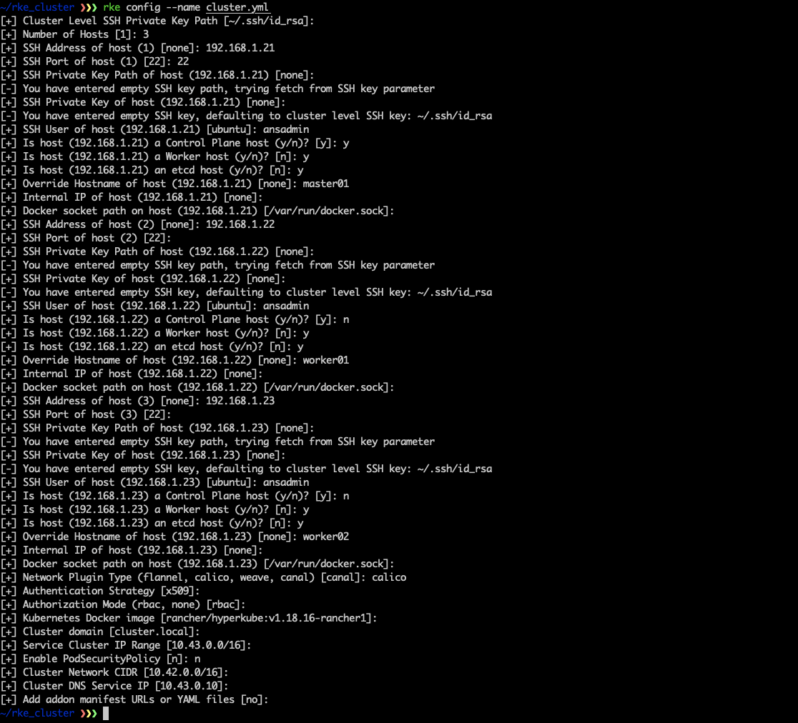

# RKE (Rancher Kubernetes Engine)+ Vagrant + Shell Script Kubernetes Cluster Kurulumu

# Rancher Nedir?
Rancher, CNCF tarafından onaylanan bir projedir. Konteyner evreninde oldukça karmaşık bir hale gelen ağ yönetimi, auto-scaler, storage vb. sorunlar için çözümleri tek bir çatı altında toplayan ve oldukça basitleştiren açık kaynak kodlu bir konteyner orkestrasyon servisidir.
Arka planda Kubernetes'ı kullanarak konteyner orkestrasyonu sağlar. Rancher farklı orkestratörle çalışabilir, aynı zamanda kendi orkestratörlerinide kullanabilir: Cattle gibi.
Rancher yardımı ile birden fazla Kubernetes clusterını tek bir yerden yönetebilirsiniz. 
Bir konteyner yönetim aracı olan Kubernetes'i daha yönetilebilir ve anlaşılabilir hale getirdi. Aslında Kubernetes'ı end-user seviyesine getirdi. 
Çoklu cluster yönetimi sayesinde, yönettiğiniz cluster/clusterlarınızın monitoring, logging işlemlerini tek bir yerden kolayca yönetmenizi sağlar. Prometheus, Alertmanager, Grafana, Kibana, Elasticsearh ve Fluentbit gibi toolları çok kolayca kurabilir ve herhangi bir provider (GCP,Azure,AWS,Digital Ocean, Bare-Metal vb.) üzerinde çalışan clusterınızı Rancher'a import edip yönetebilirisiniz. Ayni zamanda Rancher'ı kullanarak bu providerlar üzerinde yeni bir cluster oluşturabilirsiniz


# Rancher Kubernetes Engine (RKE) Nedir?
Rancher Kubernetes Engine (RKE), Bare-Meta veya sanal sunucular (virtual machine) üzerinde çalışan Docker servisine deploy edebileceğiniz CNCF sertifikalı bir Kubernetes dağıtımıdır. Kurulum için sadece target makinalarınızda Docker kurulu olması yeterlidir. Tabi ki de Rancher sizin için Docker kurulumunu da otomatize edecek bir script sunuyor. Buna yazının ilerleyen kısımlarında değineceğiz.

RKE, Comminty tarafından sunuculan karmaşık Kubernetes Cluster kurulumu işlemini basitleştirip otomatize eden çözümlerden bir tanesidir. Diğer çözümlerden biri olan Kubespray yazısına şuradan ulaşabirsiniz: 

[Kubespray ile Production Base Kubernetes Cluster Kurulumu](https://yikiksistemci.medium.com/kubespray-ile-production-base-kubernetes-cluster-kurulumu-9c7b2c68ca36)

# Vagrant Nedir?

Vagrant, HashiCorp tarafından üretilen çeşitli sanallaştırma providerları  ( Kvm/Libvirt,Virtualbox,Hyper-V, Docker, VMware vb. ) ile kullanabileceğimiz hızlıca makina yaratmamızı sağlayan açık kaynak kodlu bir araçtır. Vagrant-Cloud'tan ihtiyacağımız olan makinayı indirebilir yada kendiniz bir makina yaratıp Vagrant-Cloud'a ekleyebilirsiniz.

# Cluster Kurulumu:

### Vagrant Kurulumu -> Ubuntu:

Clusterımızı ayağa kaldıracağımız fiziksel sunucu Ubuntu/18.04.5 LTS (Bionic Beaver) olduğu için burada Vagrant kurulumu yapalım:

```bash
$ wget https://releases.hashicorp.com/vagrant/2.2.15/vagrant_2.2.15_linux_amd64.zip
$ unzip vagrant_2.2.15_linux_amd64.zip
Archive:  vagrant_2.2.15_linux_amd64.zip
  inflating: vagrant
$ sudo mv vagrant /usr/local/bin/
$ sudo chmod +x /usr/local/bin/vagrant
$ vagrant -v
Vagrant 2.2.15
```

Vagrant kurulumu tamamlandıktan sonra bizim hazırladığımız repositoryi indirip Vagrantfile'lar yardımıyla cluster için kullanacağımız makinaları ayağa kaldırıp gerekli kurulumları yapalım.

```bash
$ git clone https://github.com/yikiksistemci/medium-rke-cluster.git
$ cd medium-rke-cluster
$ medium-rke-cluster git:(main) ls -al
total 68
drwxrwxr-x  6 yyyasar yyyasar  4096 Apr 25 00:31 .
drwxr-xr-x 38 yyyasar yyyasar  4096 Apr 25 00:31 ..
drwxrwxr-x  8 yyyasar yyyasar  4096 Apr 25 00:31 .git
-rw-rw-r--  1 yyyasar yyyasar     9 Apr 25 00:31 .gitignore
-rw-rw-r--  1 yyyasar yyyasar 35149 Apr 25 00:31 LICENSE
drwxrwxr-x  2 yyyasar yyyasar  4096 Apr 25 00:31 MasterNode01
-rw-rw-r--  1 yyyasar yyyasar    14 Apr 25 00:31 README.md
drwxrwxr-x  2 yyyasar yyyasar  4096 Apr 25 00:31 WorkerNode01
drwxrwxr-x  2 yyyasar yyyasar  4096 Apr 25 00:31 WorkerNode02
```

Vagrant ile makinaları ayağı kaldırmadan önce fiziksel cihazımız üzerine RKE binary kurulumu yapalım:

Yardımcı link: [https://rancher.com/docs/rke/latest/en/installation/#download-the-rke-binary](https://rancher.com/docs/rke/latest/en/installation/#download-the-rke-binary)

```bash
$ wget https://github.com/rancher/rke/releases/download/v1.1.15/rke_linux-amd64
$ sudo mv rke_linux-amd64 /usr/local/bin/rke
$ sudo chmod +x /usr/local/bin/rke
$ rke -v
rke version v1.1.15
```

Şimdi Vagrant ile kullanacağımız makinaları ayağa kaldıralım:

```bash
$ medium-rke-cluster git:(main) cd MasterNode01
$ cat Vagrantfile

# -*- mode: ruby -*-
# vi: set ft=ruby :

Vagrant.configure("2") do |config|
  config.vm.box = "centos/7"
  config.vm.network "public_network", dev: "br0",bridge: "br0", ip: "192.168.1.21"
  config.vm.provider "libvirt" do |vb|
     vb.cpus = 4
     vb.memory = "6144"
  end
  config.vm.provision "file", source: "id_rsa.pub", destination: "/tmp/"
  config.vm.provision "file", source: "ansadmin"    , destination: "/tmp/"
  config.vm.provision "file", source: "init_script.sh", destination: "/tmp/"
  config.vm.provision "file", source: "id_rsa.pub_manager", destination: "/tmp/"
  config.vm.provision "shell",inline: "/bin/bash /tmp/init_script.sh"
end

$ cat init_script.sh

#!/bin/bash
hostnamectl set-hostname master01
update_package(){
    echo -e "Update Any Package"
    yum update -y
    echo -e "done"
}
install_common_package(){
	echo -e "Install common packages"
	yum install vim wget git python3 python3-pip net-tools -y
	echo -e "done"
}

add_k8s_node(){
	echo -e "192.168.1.21 master01 localhost" >> /etc/hosts
	echo -e "192.168.1.22 worker01" >> /etc/hosts
	echo -e "192.168.1.23 worker02" >> /etc/hosts
}

install_docker(){
     curl https://releases.rancher.com/install-docker/19.03.sh | sh
}

update_package
install_common_package
add_k8s_node
install_docker
sed -i 's/PasswordAuthentication no/PasswordAuthentication yes/g' /etc/ssh/sshd_config
sed -i 's/#PermitRootLogin yes/PermitRootLogin yes/g' /etc/ssh/sshd_config
systemctl restart sshd
useradd ansadmin
usermod -aG wheel ansadmin
usermod -aG docker ansadmin
echo -e "ansadminpass\nansadminpass" | passwd ansadmin
setenforce 0 && systemctl stop firewalld && systemctl disable firewalld
mkdir -p /home/ansadmin/.ssh && chmod 700 /home/ansadmin/.ssh && touch /home/ansadmin/.ssh/authorized_keys && chmod 600 /home/ansadmin/.ssh/authorized_keys  && chown -R ansadmin:ansadmin /home/ansadmin/.ssh
cat /tmp/id_rsa.pub > /home/ansadmin/.ssh/authorized_keys  && cat /tmp/id_rsa.pub_manager >> /home/ansadmin/.ssh/authorized_keys
ssh-keygen -t rsa -f /home/ansadmin/.ssh/id_rsa -q -P "" && chown -R ansadmin:ansadmin /home/ansadmin/.ssh
cp -a /tmp/ansadmin /etc/sudoers.d/
pkexec chown root:root /etc/sudoers /etc/sudoers.d -R
### network devices list ####
nmcli con delete "System eth0"
#nmcli con delete "Wired connection 1"
### network config ###
nmcli con mod "System eth1" ipv4.addresses 192.168.1.21/24
nmcli con mod "System eth1" ipv4.gateway 192.168.1.1
nmcli con mod "System eth1" ipv4.dns "8.8.8.8 8.8.4.4"
nmcli con mod "System eth1" ipv4.method manual
nmcli con mod "System eth1" connection.autoconnect yes
nmcli dev disconnect eth1
nmcli dev connect eth1
nmcli con show
systemctl restart NetworkManager

$  MasterNode01 git:(main) vagrant up

```

Diğer iki Worker node'u aynı şekilde ayağa kaldıralım. Qemu-Kvm ile bu makinaların çalıştığını kontrol edelim.

```bash
$ sudo virsh list

 Id    Name                           State
----------------------------------------------------
 14    MasterNode01_default           running
 15    WorkerNode01_default           running
 16    WorkerNode02_default           running
```

Makinalar ayağa kalktıktan sonra RKE ile cluster.yml dosyamızı oluşturalım ve makina tanımlarımızı ekleyelim.



Daha sonra "rke up" komutu ile cluster kurulumunu başlatalım.

```bash
$ rke up                                                                                                                                                                                             (docker-desktop/default)
INFO[0000] Running RKE version: v1.1.15
INFO[0000] Initiating Kubernetes cluster
INFO[0000] [dialer] Setup tunnel for host [192.168.1.21]
INFO[0000] [dialer] Setup tunnel for host [192.168.1.22]
INFO[0000] [dialer] Setup tunnel for host [192.168.1.23]
INFO[0000] Checking if container [cluster-state-deployer] is running on host [192.168.1.21], try #1
INFO[0000] Pulling image [rancher/rke-tools:v0.1.72] on host [192.168.1.21], try #1
INFO[0011] Image [rancher/rke-tools:v0.1.72] exists on host [192.168.1.21]
INFO[0015] Starting container [cluster-state-deployer] on host [192.168.1.21], try #1
INFO[0015] [state] Successfully started [cluster-state-deployer] container on host [192.168.1.21]
INFO[0015] Checking if container [cluster-state-deployer] is running on host [192.168.1.22], try #1
INFO[0015] Pulling image [rancher/rke-tools:v0.1.72] on host [192.168.1.22], try #1
INFO[0027] Image [rancher/rke-tools:v0.1.72] exists on host [192.168.1.22]
INFO[0027] Starting container [cluster-state-deployer] on host [192.168.1.22], try #1
INFO[0028] [state] Successfully started [cluster-state-deployer] container on host [192.168.1.22]
INFO[0028] Checking if container [cluster-state-deployer] is running on host [192.168.1.23], try #1
INFO[0028] Pulling image [rancher/rke-tools:v0.1.72] on host [192.168.1.23], try #1
INFO[0040] Image [rancher/rke-tools:v0.1.72] exists on host [192.168.1.23]
INFO[0042] Starting container [cluster-state-deployer] on host [192.168.1.23], try #1
INFO[0042] [state] Successfully started [cluster-state-deployer] container on host [192.168.1.23]
INFO[0042] [certificates] Generating CA kubernetes certificates
INFO[0043] [certificates] Generating Kubernetes API server aggregation layer requestheader client CA certificates
INFO[0043] [certificates] GenerateServingCertificate is disabled, checking if there are unused kubelet certificates
```

Kurulum tamamlandıktan sonra config dosyasını ".kube/config" altına kopyalayalım ve cluster state'ine bakalım.

```bash
$ cp kube_config_cluster.yml ~/.kube/config
$ kubectl get nodes -o wide
NAME       STATUS   ROLES                      AGE   VERSION    INTERNAL-IP    EXTERNAL-IP   OS-IMAGE                KERNEL-VERSION                CONTAINER-RUNTIME
master01   Ready    controlplane,etcd,worker   10m   v1.18.16   192.168.1.21   <none>        CentOS Linux 7 (Core)   3.10.0-1160.24.1.el7.x86_64   docker://19.3.15
worker01   Ready    etcd,worker                10m   v1.18.16   192.168.1.22   <none>        CentOS Linux 7 (Core)   3.10.0-1127.el7.x86_64        docker://19.3.15
worker02   Ready    etcd,worker                10m   v1.18.16   192.168.1.23   <none>        CentOS Linux 7 (Core)   3.10.0-1127.el7.x86_64        docker://19.3.15
```


